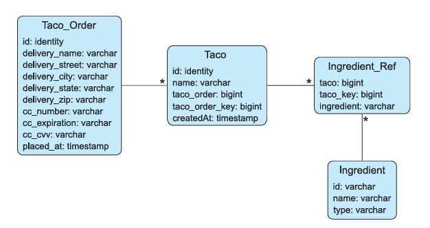

## Chapter 1:
* Created the initial project structure using Spring Initializr;
* Wrote a controller class to handle the request to the home page;
* Defined a view template to display the home page;
* Wrote a simple test class to verify the functionality of the home page controller.
* Successfully ran the project

## Chapter 2:
* Created domain models
* Created Views
* Created Controllers 
* Added validation

## Chapter 3.1:

* Prepared storage objects (added ID)
* Added H2 database, disabled database name generation
* Added `spring-boot-starter-jdbc`
* Created interfaces for repositories
* Implemented the interfaces (`@Repository`, injected `JdbcTemplate` via constructor)
* Added script files `schema.sql` and `data.sql` (executed at startup)
* Created methods for saving data; saving complex data this way requires a lot of code
* Used repositories in controllers

## Chapter 3.2
* Replaced `spring-boot-starter-jdbc` with `spring-boot-starter-data-jdbc`.
* Added `@Id` and `@Table` annotations to domain classes.
* Refactored repository interfaces by extending `CrudRepository<>`.
* Removed interface implementations since Spring takes care of it automatically.
* `CommandLineRunner` and `ApplicationRunner`.

## Chapter 3.3

* Added `spring-boot-starter-data-jpa`
* Removed `@Table`, added `@Entity`, `@ManyToMany`, and `@OneToMany` to classes
* Added several specialized methods to the repository interface
* `List<TacoOrder> findByDeliveryToAndDeliveryCityAllIgnoresCase(String deliveryTo, String deliveryCity);`

### Summary
* `JdbcTemplate` significantly simplifies working with JDBC.
* `PreparedStatementCreator` and `KeyHolder` can be used together when retrieving an identifier generated by the database.
* `Spring Data JDBC` and `Spring Data JPA` simplify working with relational databases by reducing the process to defining repository interfaces.

### Chapter 5

* Authentication and SecurityConfig have been added
* Login and registration pages implemented
* Linked the User table with the Order table

### Chapter 7
* Created REST API and client via RestTemplate
